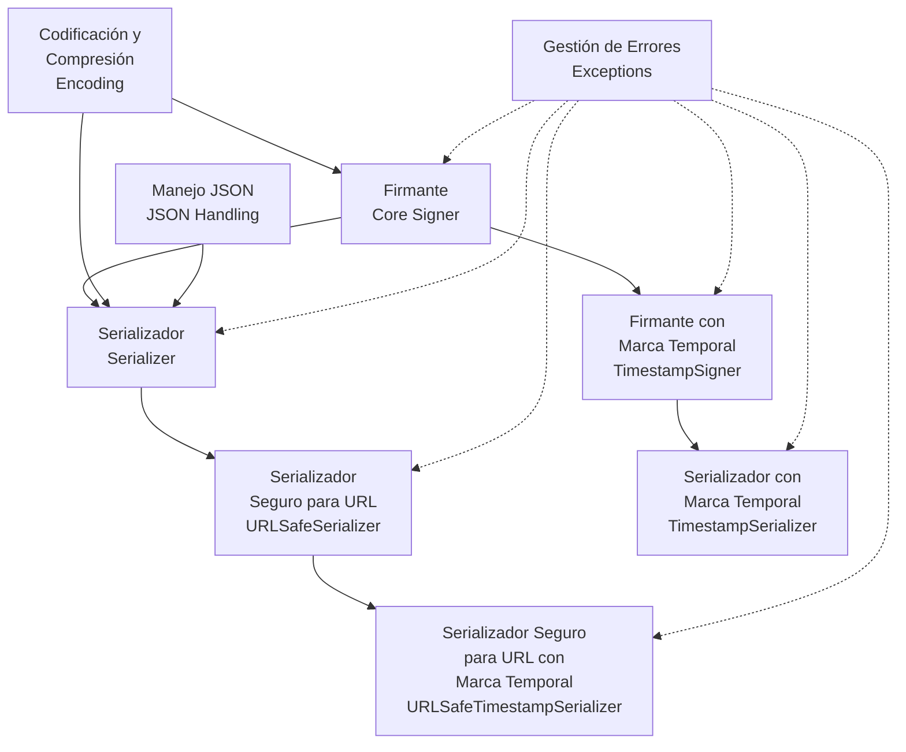

# Visión general

<!-- Maintained by Tidewiki. Edits are kept on later updates; wrap text in tidewiki:keep markers to freeze it. -->

ItsDangerous es una librería de Python que permite transmitir datos de forma segura a entornos no confiables y recuperarlos sin alteraciones. Utiliza firma criptográfica para garantizar que los tokens no hayan sido manipulados, ofreciendo además características como serialización de objetos, marcas temporales y codificación segura para URLs. [`README.md:5-11`](../../README.md#L5-L11)

## ¿Qué resuelve?

El problema fundamental es que a menudo necesitas pasar datos entre sistemas que no confías completamente. Por ejemplo, en aplicaciones web, podrías necesitar enviar información del usuario en una cookie o parámetro de URL. ItsDangerous garantiza que si alguien intenta modificar ese dato, lo detectarás inmediatamente. [`README.md:5-7`](../../README.md#L5-L7)

## Componentes principales



Los componentes se organizan en capas:

1. **Base de criptografía**: [[core-signer.md]] proporciona la funcionalidad fundamental de firma. Es el componente más bajo sobre el que se construye todo lo demás.

2. **Serialización**: [[serializer.md]] añade la capacidad de guardar estructuras de datos Python complejas de forma segura, combinando serialización con firma criptográfica.

3. **Especialización para URL**: [[url-safe.md]] genera tokens que pueden usarse de forma segura en URLs, evitando caracteres problemáticos.

4. **Validación temporal**: [[timestamp.md]] permite verificar no solo que los datos no fueron alterados, sino también que fueron firmados dentro de un período específico.

5. **Soporte transversal**:
   - [[encoding.md]] maneja la codificación base64, compresión zlib y conversiones entre bytes y cadenas.
   - [[json-handling.md]] proporciona utilidades especializadas para JSON.
   - [[exceptions.md]] define todos los errores que pueden ocurrir.

## Ejemplo rápido

[`README.md:19-30`](../../README.md#L19-L30)

```python
from itsdangerous import URLSafeSerializer
auth_s = URLSafeSerializer("secret key", "auth")
token = auth_s.dumps({"id": 5, "name": "itsdangerous"})

print(token)
# eyJpZCI6NSwibmFtZSI6Iml0c2Rhbmdlcm91cyJ9.6YP6T0BaO67XP--9UzTrmurXSmg

data = auth_s.loads(token)
print(data["name"])
# itsdangerous
```

## Guías de uso

Para aprender a usar la librería, consulta:

- **[Guía de Firma Criptográfica](signing-guide.md)**: Protege datos contra manipulación con ejemplos prácticos.
- **[Guía de Serialización](serialization-guide.md)**: Serializa y deserializa objetos Python complejos de forma segura.
- **[Guía de Tokens Seguros para URL](url-safe-guide.md)**: Genera tokens seguros para URLs y parámetros de consulta.
- **[Guía de Marcas Temporales](timestamp-guide.md)**: Añade y verifica marcas temporales para garantizar actualidad.
- **[Guía de Codificación](encoding-guide.md)**: Optimiza el tamaño de los tokens con compresión y codificación.

## Referencia técnica

Para información completa sobre clases, funciones y excepciones:

- **[Referencia de API Pública](api-reference.md)**: La interfaz pública que usan los desarrolladores.
- **[Referencia de Excepciones](exceptions-reference.md)**: Todas las excepciones que puede lanzar la librería y cómo manejarlas.
- **[Conceptos Fundamentales](concepts.md)**: Los principios detrás de la firma criptográfica y el diseño del sistema.

## Documentación del proyecto

Para entender cómo está construido y contribuir:

- **[Configuración del Proyecto](project-configuration.md)**: Construcción, dependencias y metadatos. [`pyproject.toml:1-16`](../../pyproject.toml#L1-L16)
- **[Configuración del Entorno de Desarrollo](development-setup.md)**: Configura tu entorno para trabajar en el código. [`CONTRIBUTING.rst:98-123`](../../CONTRIBUTING.rst#L98-L123)
- **[Flujos de Integración Continua](ci-cd-pipelines.md)**: Pruebas automáticas y publicación de releases.
- **[Generación de Documentación](documentation-build.md)**: Cómo generar la documentación con Sphinx.
- **[Guía de Contribución](contributing.md)**: Cómo contribuir al proyecto, incluyendo estándares de código. [`CONTRIBUTING.rst:43-66`](../../CONTRIBUTING.rst#L43-L66)
- **[Registro de Cambios](changelog.md)**: Todas las características, correcciones y cambios en cada versión.

## Información del proyecto

- **Versión actual**: 2.2.0 [`pyproject.toml:3`](../../pyproject.toml#L3)
- **Requisitos**: Python >= 3.8 [`pyproject.toml:16`](../../pyproject.toml#L16)
- **Licencia**: BSD [`pyproject.toml:6`](../../pyproject.toml#L6)
- **Mantenedor**: Pallets [`pyproject.toml:7`](../../pyproject.toml#L7)
- **Repositorio**: https://github.com/pallets/itsdangerous/
