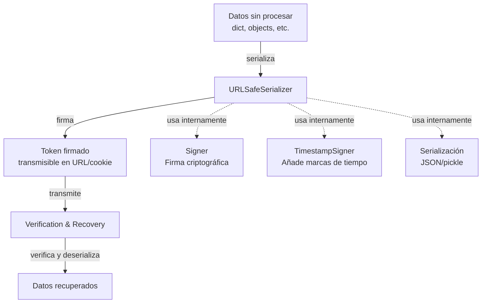

# Visión general

<!-- Maintained by Tidewiki. Edits are kept on later updates; wrap text in tidewiki:keep markers to freeze it. -->

ItsDangerous es una librería Python que facilita el paso seguro de datos hacia entornos no confiables y su recuperación posterior intacta. Utiliza firmas criptográficas para garantizar que los datos no hayan sido modificados, permitiendo que aplicaciones web transmitan información sensible (como identificadores de usuario) en cookies, URLs o tokens sin riesgo de manipulación.

## ¿Qué es ItsDangerous?

[`README.md:7-13`](../../README.md#L7-L13) ItsDangerous proporciona herramientas para pasar datos a entornos no confiables y recuperarlos de forma segura. Los datos se firman criptográficamente para asegurar que un token no haya sido alterado. Es posible personalizar cómo se serializan los datos, comprimiéndolos según sea necesario, y añadir marcas de tiempo que se verifiquen automáticamente al cargar un token.

## Ejemplo básico

[`README.md:21-32`](../../README.md#L21-L32) El uso típico es serializar datos complejos (como un diccionario con información de usuario) en un token seguro:

```python
from itsdangerous import URLSafeSerializer
auth_s = URLSafeSerializer("secret key", "auth")
token = auth_s.dumps({"id": 5, "name": "itsdangerous"})

print(token)
# eyJpZCI6NSwibmFtZSI6Iml0c2Rhbmdlcm91cyJ9.6YP6T0BaO67XP--9UzTrmurXSmg

data = auth_s.loads(token)
print(data["name"])
# itsdangerous
```

## Componentes principales



Los componentes principales de ItsDangerous son:

- ****: Componente central que genera y verifica firmas criptográficas. Garantiza que los datos no hayan sido modificados.
- ****: Sistema que convierte objetos Python complejos a tokens firmados y viceversa, manejando serialización segura.
- ****: Extensión del firmante que añade marcas de tiempo para verificar la antigüedad de tokens y su validez temporal.
- ****: Variantes optimizadas para transmisión en URLs y cookies, evitando caracteres problemáticos.

## Estructura del proyecto

[`pyproject.toml:1-16`](../../pyproject.toml#L1-L16) ItsDangerous es un proyecto Python que requiere versión 3.10 o superior. La versión actual es 2.3.0 en desarrollo, clasificada como Production/Stable.

El proyecto incluye:

- **Código fuente**: Módulo principal `itsdangerous` con tipos estáticos completos
- **Documentación**: Compilada con Sphinx en `docs/`
- **Pruebas**: Suite de pruebas en `tests/` ejecutada con pytest
- **Ejemplos**: Código de ejemplo en `examples/`

[`pyproject.toml:25-54`](../../pyproject.toml#L25-L54) Se utiliza `uv` como gestor de dependencias, organizando grupos para desarrollo, documentación, pruebas y análisis de tipos.

## Cómo ejecutar y desarrollar

### Instalar dependencias de desarrollo

```bash
uv sync
```

### Ejecutar pruebas

```bash
pytest -v
```

### Validar código

[`pyproject.toml:160-164`](../../pyproject.toml#L160-L164) Para ejecutar todas las verificaciones de estilo (linting, formatting, seguridad):

```bash
tox -e style
```

### Validar tipos

[`pyproject.toml:166-173`](../../pyproject.toml#L166-L173) Para ejecutar verificación estática de tipos:

```bash
tox -e typing
```

### Construir documentación

[`pyproject.toml:175-183`](../../pyproject.toml#L175-L183) Para construir la documentación Sphinx:

```bash
tox -e docs
```

Para desarrollo continuo con servidor local:

```bash
tox -e docs-auto
```

## Guía de la wiki

Esta documentación está organizada en las siguientes secciones:

- **[Conceptos Fundamentales](conceptos-fundamentales.md)**: Introducción a los conceptos clave: firma criptográfica, serialización segura y casos de uso.

- **[Firmante (Signer)](firmante.md)**: El componente central que genera y verifica firmas criptográficas para garantizar la integridad de datos.

- **[Serializador](serializador.md)**: Sistema para serializar datos complejos de forma segura, convirtiendo objetos Python a tokens firmados.

- **[Firmante con Tiempo](firmante-con-tiempo.md)**: Extensión que añade marcas de tiempo a los tokens para verificar su antigüedad y validez temporal.

- **[Codificación URL Segura](url-segura.md)**: Variantes de firmante y serializador diseñadas para transmisión segura en URLs y cookies.

- **[Codificación y Excepciones](codificacion-y-excepciones.md)**: Utilidades para manejar codificación de caracteres y excepciones personalizadas del sistema.

- **[Construcción y Documentación](construccion-y-documentacion.md)**: Configuración del proyecto, construcción de documentación Sphinx y publicación del paquete.

- **[Flujo de Integración Continua](flujo-de-integracion.md)**: Automatización de pruebas, verificación de código, construcción y publicación mediante workflows de GitHub.
