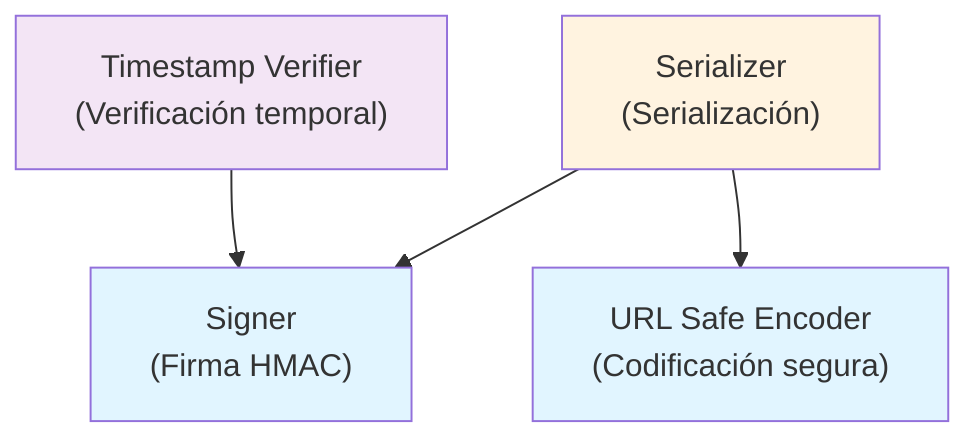

# Visión general

<!-- Maintained by Tidewiki. Edits are kept on later updates; wrap text in tidewiki:keep markers to freeze it. -->

ItsDangerous es una librería de Python que proporciona herramientas para transmitir datos de forma segura a entornos no confiables y recuperarlos sin alteraciones. [`README.md:5-7`](../../README.md#L5-L7) Los datos se firman criptográficamente para garantizar que no hayan sido modificados. [`README.md:9-11`](../../README.md#L9-L11)

## ¿Qué hace ItsDangerous?

La librería resuelve el problema de intercambiar datos seguros entre aplicaciones, especialmente en contextos web donde los tokens o datos deben viajar por canales potencialmente inseguros. Por ejemplo, permite generar un token con información de un usuario que puede ser enviado al cliente y posteriormente verificado sin riesgo de manipulación.

[`README.md:19-30`](../../README.md#L19-L30) Un ejemplo típico es serializar datos de un usuario, transmitirlos en una cookie o parámetro URL, y verificar su integridad al recibirlos:

```python
from itsdangerous import URLSafeSerializer
auth_s = URLSafeSerializer("secret key", "auth")
token = auth_s.dumps({"id": 5, "name": "itsdangerous"})
data = auth_s.loads(token)
```

## Componentes principales

ItsDangerous está construida sobre varios componentes que trabajan en conjunto:



- **[Signer (Firma de datos)](signer.md)**: Sistema central que genera y verifica firmas HMAC. Garantiza la autenticidad de los datos usando una clave secreta.

- **[URL Safe Encoder (Codificación segura para URL)](url-safe-encoding.md)**: Codifica los datos en un formato seguro para transmitir en URLs y bases de datos, permitiendo caracteres especiales sin problemas.

- **[Serializer (Serialización y compresión)](serializer.md)**: Serializa objetos Python a formatos seguros (como JSON o pickle) e integra automáticamente la firma. Comprime los datos cuando es necesario.

- **[Timestamp Verifier (Verificación con marca de tiempo)](timestamp-verification.md)**: Extensión que añade marcas de tiempo a los tokens para controlar su validez temporal, permitiendo rechazar tokens antiguos.

## Cómo ejecutar el código

[`CONTRIBUTING.rst:69-122`](../../CONTRIBUTING.rst#L69-L122) Para configurar el entorno de desarrollo:

```bash
git clone https://github.com/pallets/itsdangerous
cd itsdangerous
python3 -m venv env
. env/bin/activate  # En Windows: env\Scripts\activate
pip install -r requirements/dev.txt && pip install -e .
pre-commit install
```

[`CONTRIBUTING.rst:171-184`](../../CONTRIBUTING.rst#L171-L184) Para ejecutar las pruebas:

```bash
pytest              # Pruebas del entorno actual
tox                 # Suite completa de pruebas
```

## Guía de referencia

- **[API Reference (Referencia de API y conceptos)](api-reference.md)** — Conceptos fundamentales, excepciones y configuración general de la librería.

- **[Development Setup (Configuración y desarrollo)](development-setup.md)** — Herramientas de desarrollo, dependencias y configuración del entorno para contribuidores.

- **[CI and Deployment (Integración continua y publicación)](ci-and-deployment.md)** — Flujos de trabajo automatizados para pruebas, verificación de seguridad y publicación de versiones.

- **[Documentation (Sistema de documentación)](documentation.md)** — Cómo construir la documentación con Sphinx y ReadTheDocs.

- **[Changelog (Historial de cambios)](changelog.md)** — Registro de versiones y cambios significativos del proyecto.
