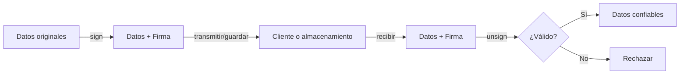

# Guía de Firma Criptográfica

<!-- Maintained by Tidewiki. Edits are kept on later updates; wrap text in tidewiki:keep markers to freeze it. -->

Esta guía explica cómo usar el firmante para proteger datos contra manipulación, asegurando que puedan detectarse cambios no autorizados. La firma criptográfica es el mecanismo fundamental para validar la integridad de los datos.

## Concepto básico

La firma criptográfica adjunta un código único a un string basado en una clave secreta. Si alguien modifica el contenido original, la firma ya no coincidirá y la validación fallará. De esta forma, puedes verificar que los datos no han sido alterados.

Para entender mejor los principios criptográficos subyacentes, consulta [Firmante: Base de Criptografía](core-signer.md).

## Uso fundamental

### Firmar un string

[`docs/signer.rst:11-14`](../../docs/signer.rst#L11-L14)

```python
from itsdangerous import Signer

s = Signer("secret-key")
resultado = s.sign("my string")
# resultado es: b'my string.wh6tMHxLgJqB6oY1uT73iMlyrOA'
```

La firma se añade al final del string, separada por un punto. La clave secreta debe ser conocida solo por tu aplicación; si se compromete, las firmas pueden ser falsificadas.

### Validar un string firmado

[`docs/signer.rst:17-22`](../../docs/signer.rst#L17-L22)

```python
s.unsign(b"my string.wh6tMHxLgJqB6oY1uT73iMlyrOA")
# Devuelve: b'my string'
```

El método `unsign` extrae el contenido original si la firma es válida.

### Detectar manipulación

[`docs/signer.rst:28-36`](../../docs/signer.rst#L28-L36)

Si el contenido ha sido alterado, `unsign` lanza una excepción:

```python
s.unsign(b"different string.wh6tMHxLgJqB6oY1uT73iMlyrOA")
# Genera: BadSignature: Signature does not match
```

Siempre debes capturar esta excepción al trabajar con datos potencialmente no confiables. Para más detalles sobre el manejo de excepciones, consulta [Gestión de Errores](exceptions.md).

## Casos de uso prácticos

### Proteger tokens en sesiones

Puedes firmar tokens de sesión para evitar que los clientes los modifiquen:

```python
from itsdangerous import Signer

# Al crear la sesión
signer = Signer("my-secret-key")
session_token = signer.sign("user_id:12345")

# Al recibir el token del cliente
try:
    validated_token = signer.unsign(session_token)
except BadSignature:
    # Token fue modificado, rechazar
    print("Sesión inválida")
```

### Firmar datos serializados

Cuando usas el serializador para almacenar estructuras de datos, la firma protege toda la estructura:

- Lee [Serializador: Almacenamiento de Estructuras de Datos](serializer.md) para combinar firmas con serialización.

### URLs seguras con firmas

Para tokens en URLs que no deben ser modificados, combina firmas con codificación segura:

- Consulta [Codificación Segura para URL](url-safe.md) para métodos específicos.

### Agregar marca temporal a firmas

Si necesitas saber cuándo se creó la firma y rechazar las antiguas:

- Mira [Validación con Marca Temporal](timestamp.md).

## Flujo típico de integración



## Algoritmos de firma

[`docs/signer.rst:44-49`](../../docs/signer.rst#L44-L49)

El módulo soporta diferentes algoritmos para generar firmas. Por defecto se usa `HMACAlgorithm`, que es seguro para la mayoría de casos. Los detalles técnicos están en [Firmante: Base de Criptografía](core-signer.md).

## Consideraciones importantes

- **Clave secreta**: Guárdala en variables de entorno, nunca la incluyas en el código.
- **Codificación**: Si pasas strings Unicode, se convierten automáticamente a UTF-8. Después de `unsign` no sabrás si era Unicode o bytes.
- **Excepciones**: Siempre captura `BadSignature` cuando valides datos de clientes. Consulta [Gestión de Errores](exceptions.md) para estrategias de manejo.

## Próximos pasos

- Para firmar estructuras de datos complejas, usa [Guía de Serialización](serialization-guide.md).
- Si necesitas validar cuándo fue creado algo, mira [Guía de Marcas Temporales](timestamp-guide.md).
- Para una referencia completa de la API, consulta [Referencia de API Pública](api-reference.md).
